# Kubernetes, Hyperflex, ACI OH MY!


Table of Contents
=================
* [Credentials](#credentials)
* [Preparation](#preparation)
	* [Logging In](#logging-in)
	* [Connecting to Remote Desktop](#connecting-to-remote-desktop)
		* [Postman Setup](#postman-setup)
* [Connect to SSH Host](#connect-to-ssh-host)
* [Connect to Cisco Container Platform UI](#connect-to-cisco-container-platform-ui)
* [Create New Cluster](#create-new-cluster)
	* [Page 1](#page-1)
	* [Page 2](#page-2)
	* [Page 3](#page-3)
	* [Page 4](#page-4)
	* [Page 5](#page-5)
* [Explore ACI](#explore-aci)
* [Connect to CCP Cluster](#connect-to-ccp-cluster)
* [Deploy Database](#deploy-database)
* [Clone the Git Repo](#clone-the-git-repo)
* [Deploy LiveWall](#deploy-livewall)
* [Persistant Volumes](#persistant-volumes)

## Credentials

| Username | Pod Number | ssh host     | username | password    | CCP Cluster CIDR  |
|----------|------------|--------------|----------|-------------|-------------------|
| demo1    | Pod1       | 10.139.14.21 | root     | C1sco12345! | 10.139.161.0/27   |
| demo2    | Pod2       | 10.139.14.22 | root     | C1sco12345! | 10.139.161.32/27  |
| demo3    | Pod3       | 10.139.14.23 | root     | C1sco12345! | 10.139.161.64/27  |
| demo4    | Pod4       | 10.139.14.24 | root     | C1sco12345! | 10.139.161.96/27  |
| demo5    | Pod5       | 10.139.14.25 | root     | C1sco12345! | 10.139.161.128/27 |
| demo6    | Pod6       | 10.139.14.26 | root     | C1sco12345! | 10.139.161.160/27 |
| demo7    | Pod7       | 10.139.14.27 | root     | C1sco12345! | 10.139.161.192/27 |
| demo8    | Pod8       | 10.139.14.28 | root     | C1sco12345! | 10.139.161.224/27 |
| demo9    | Pod9       | 10.139.14.29 | root     | C1sco12345! | 10.139.162.0/27   |
| demo10   | Pod10      | 10.139.14.30 | root     | C1sco12345! | 10.139.162.32/27  |
| demo11   | Pod11      | 10.139.14.31 | root     | C1sco12345! | 10.139.162.64/27  |
| demo12   | Pod12      | 10.139.14.32 | root     | C1sco12345! | 10.139.162.96/27  |
| demo13   | Pod13      | 10.139.14.33 | root     | C1sco12345! | 10.139.162.128/27 |
| demo14   | Pod14      | 10.139.14.34 | root     | C1sco12345! | 10.139.162.160/27 |
| demo15   | Pod15      | 10.139.14.35 | root     | C1sco12345! | 10.139.162.192/27 |
| demo16   | Pod16      | 10.139.14.36 | root     | C1sco12345! | 10.139.162.224/27 |
| demo17   | Pod17      | 10.139.14.37 | root     | C1sco12345! | 10.139.163.0/27   |
| demo18   | Pod18      | 10.139.14.38 | root     | C1sco12345! | 10.139.163.32/27  |
| demo19   | Pod19      | 10.139.14.39 | root     | C1sco12345! | 10.139.163.64/27  |

## Preparation

Before we create our first CCP cluster we need to access the lab.  The lab leverages a Cisco Field Lab in the DMZ.  We will leverage the Cisco Anyconnect Client to access this lab

## Logging In

* Open your Cisco Anyconnect Client
	* Connect to vpn.reqdemo.com 
	* Select "reqlab-admin" as the domain
	(your vpn may drop and reconnect after 1 minute.  This is normal)
	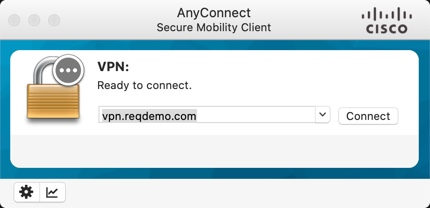
	
	
* For MAC users running Catalina.  Mac Security Policies have been enhanced.  See below:
https://support.apple.com/en-us/HT210176

* To work around this please do the following:

```
cd /opt/cisco/AnyConnect
sudo nano AnyConnectLocalPolicy.xml
```

* Edit ExcludeMacNativeCertStore to "true"

```
<ExcludeMacNativeCertStore>true</ExcludeMacNativeCertStore>
```

^X  (control X to exit)
press Y to indicate that you want to save
press enter to accept the existing name

Quit anyconnect and re-launch

## Connecting to Remote Desktop	
* Using your favorite remote desktop client RDP to:
	* req-rdp.csc.richfield.cisco.com
		* Login using the lab credentials provided
			* format should be csc\<username>
		* username: demoXX
		* password: "C1sco12345!"
		* Close the Server Manager Screen If present
		
### Postman Setup

* Open the Postman App on the Desktop
	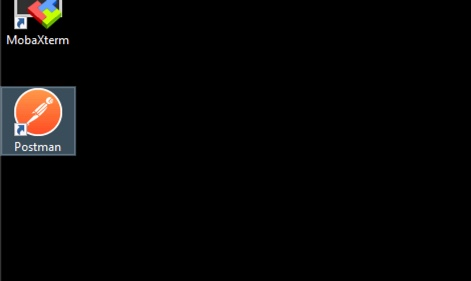
	
	* In the upper left hand corner select "Import"
	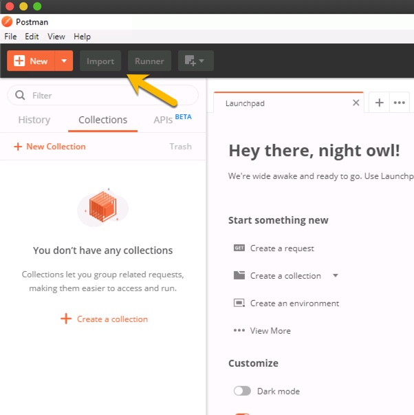
	* Select "Choose Files"
	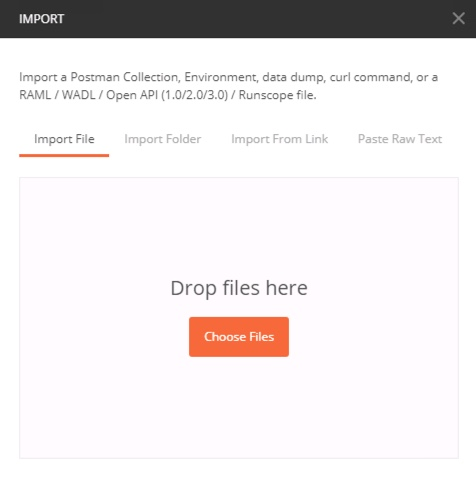
	* Browse to "C:\CCP Lab"
		* Select "sevt.json"
		* Select "Open"
	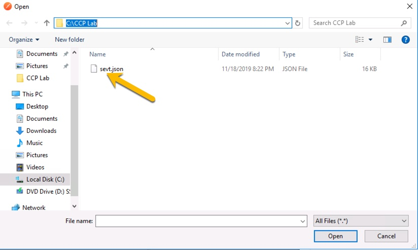
	* The Collection of Postman Scripts is now under your "Collections" in Postman
	* In the upper righthand corner select the "Gear Icon"
	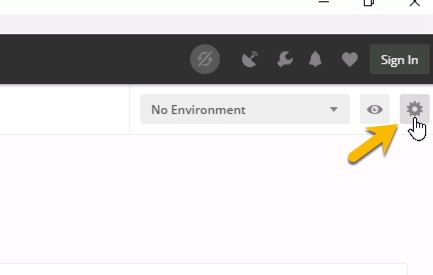
	* Create a new Environment
		* Postman variables can be used by creating an environment where the variables and their values are defined.  Name the environment "CCP"
		* Add the variables as seen in the screenshot.
			* Note in the "tenant" variable put your "pod value there"
			* replace the username and password with the values you have been given
		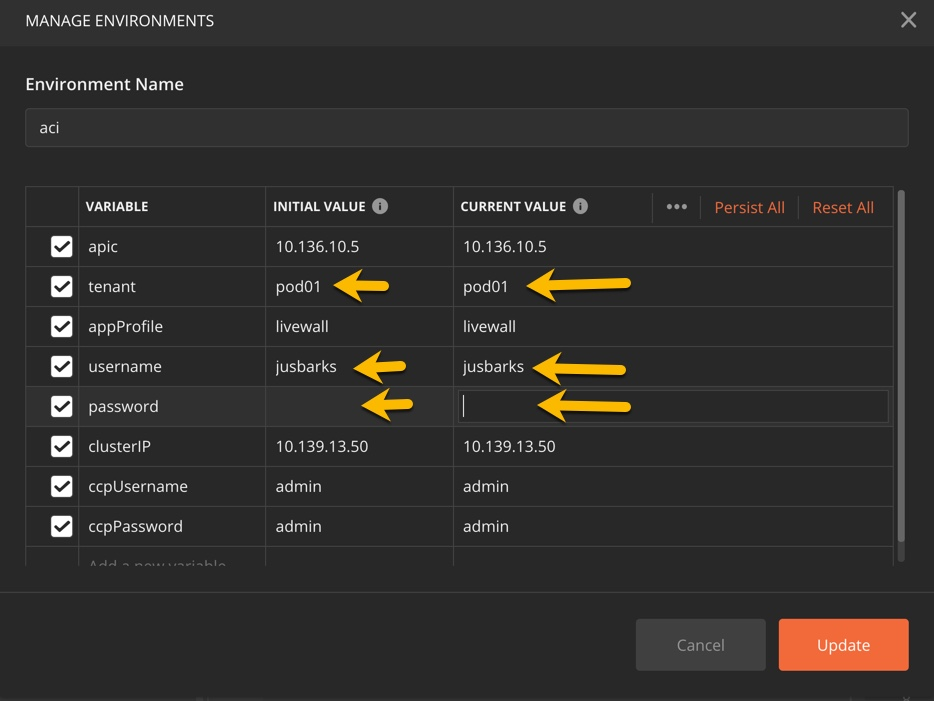
		* Select "Add" when completed.
		* 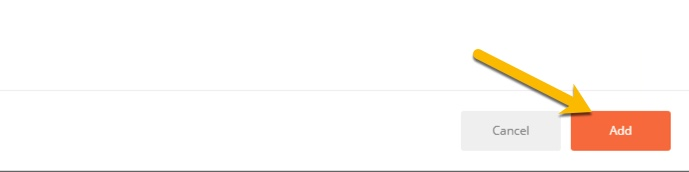
	
	* We will use this later
	* Open a Browser from the Desktop
		* Login to https://10.136.10.5
			* Accept the security warning
			* Login with the APIC Credentials you have been provided.
				* Select "acs" as the Domain
			* Select "Get Started" if the splash screen appears
			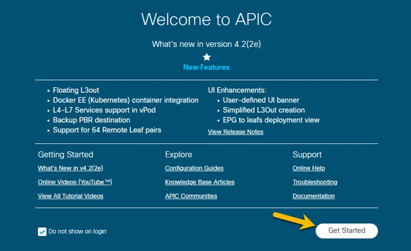
## Connect to SSH Host
* ssh to the IP Address you were provided
	* Use the user [credentials](!credentials) you were provided.
* Create ssh key
	```
	ssh-keygen -t ecdsa
	```
	* Accept the defaults (press enter until the screen looks like below
	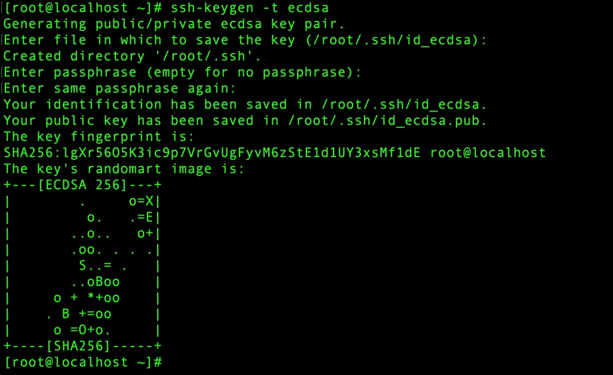
	
## Connect to Cisco Container Platform UI
* Open a web browser and browse to https://10.139.13.50
	* Accept the security warning
	* Use the credentials admin/admin
* We will be deploying a version 2 cluster.  In the top section of the screen select the "Version 2" from the dropdown.
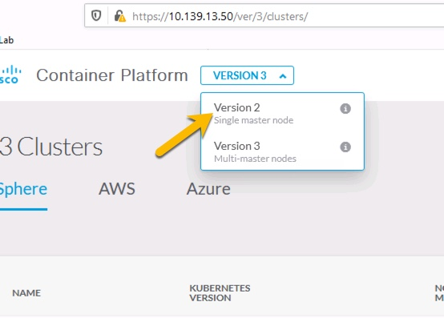

## Create New Cluster
* Select "New Cluster" in the upper right hand of the page.
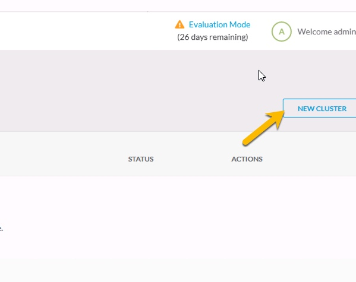
#### Page 1
* Populate the fields as follows
		* Infrastructure Provider - vsphere
		* Kubernetes Cluster Name - podXX (where XX is your 2 digit pod number)
		* Kubernetes Version 1.14.6
		* ACI-CNI Profile - req-aci
		* Description - (Optional)
		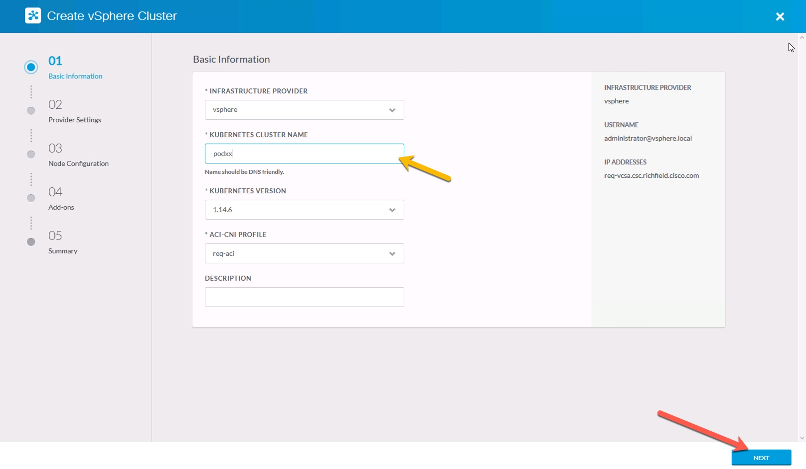
		* Select "Next"

#### Page 2
* Populate the fields as follows
		* Data Center - Richfield
		* Cluster - cloud-hybrid-hx
		* Resource Pool - Resources
		* Storage Class - vsphere
		* Hyperflex Storage Network - k8-priv-iscsivm-network
		* Datastore - ccp
		* VM Template - ccp-tenant-image-1.14.6-ubuntu18-5.0.0
		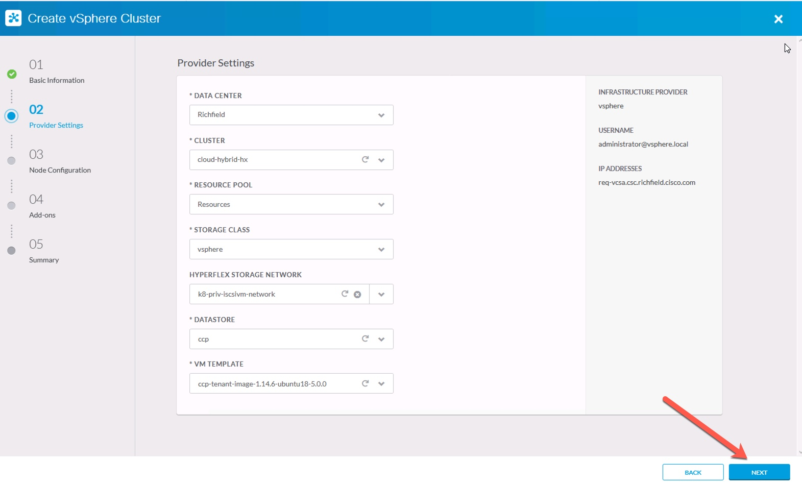
	 	* Select "Next"
 
#### Page 3
* Populate the fields as follows
	* VM Username - ccpuser
	* SSH Public Key - Varies
	* Note to get your ssh key we created before go to your ssh host and type the below command.
	```
	cat ~/.ssh/id_ecdsa.pub
	```
	* Node Subnet in CIDR Notation - See [credentials](!credentials) for your pod subnet.
	* Root CA Certificate - Copy and paste the below
```
	-----BEGIN CERTIFICATE-----
MIIFgTCCA2mgAwIBAgIUX38UgEe62UciNB3PQmifewgGo1YwDQYJKoZIhvcNAQEL
BQAwJjEXMBUGA1UEAwwOaW5ncmVzcy5oYXJib3IxCzAJBgNVBAsMAkNBMB4XDTE5
MDkxNzE1NDAzM1oXDTIxMDkxNjE1NDAzM1owJjEXMBUGA1UEAwwOaW5ncmVzcy5o
YXJib3IxCzAJBgNVBAsMAkNBMIICIjANBgkqhkiG9w0BAQEFAAOCAg8AMIICCgKC
AgEA8wG2lUBq796TJsRnnqFjNwW78PLN9PV/F82T0dpF+DG5KbEo4M9ipYHdNDg1
B+x9I6pQXRculhw8mk5dLNFKNitKNl8rNGZeCqFvrLd/CM289G/lbUbEXsyKDDIr
u9ZunKUogwVugEEs2pkplFrVmgSH7jiDZNlZgPcRMcNOYkGPcAA5AQVBRrls9zzp
bimsCyumzZanUkH08wyx65xQ2p2526JFTi9uSEWAekfdXkXvZvyZ+dQi3+vXDDOi
GsGoHp/Q5YI8ql32MWCu0RRqPIQcP0G64yUYRR10m3qew2MF0YluJTabj20gAD0P
Fg8bVNpf1+YhsbJgSPmtpVXTyIDARciONZM/UZEpSbgtCA0UOoajZlYJOXYHvkJD
bbPHmS3CfEHMnjZ4n/tV8LTMVsZtL+JGDzgCkUJTt5nEyZd3Ls6JP4ZuyJR0jtdf
Jf8mNih7AStRs4aI/EdbQsKEGGPI2iNT1PjQXnXrpinYUXElRDu6QSrvjlGOVCbB
Y6zzoeHNF2WYBO4Wl+uDXOgncgMcN9UOPfkU7monk9t4OaflvtLCP4I6ZWYaKLZc
TPGqQHhmOGgUrV31XXR5wpCYclLJYb6mXwceWPSM5Xb3VZAU0UJMCJ35tPlIaJKt
m+7ofJmO5GKetMdn1NQDT+NckJj2Gxp2zddRFiKGmKJ4oYsCAwEAAaOBpjCBozAS
BgNVHRMBAf8ECDAGAQH/AgEAMAsGA1UdDwQEAwICpDAdBgNVHQ4EFgQUtTYXvk70
R0ds/V0T7a4xtgylZlcwYQYDVR0jBFowWIAUtTYXvk70R0ds/V0T7a4xtgylZleh
KqQoMCYxFzAVBgNVBAMMDmluZ3Jlc3MuaGFyYm9yMQswCQYDVQQLDAJDQYIUX38U
gEe62UciNB3PQmifewgGo1YwDQYJKoZIhvcNAQELBQADggIBAKzVOSvNKvcaU8Xe
csPG710DcHh0ei6Iqp2ZASc8XFlDSl0b77H9mwii8oZ+5KFT4xy3JyWZzhuxb/wN
/MqivsOBa7vy3q8aeUzXyXHxf3jHPGFh27vGor+UaO4fHFW9uK3JG/z6m94KUta/
YKWRO2ljI/pvn1h0iRV1aUGaqEEWmeGwAvj/xsJsS4D3Byh4rTfExKJdgxibtPWi
3P0lxbo09ocmPpo0DWAiToI8AfGhGvJWD99sroMVpmM70Op66N42spzjpQ9lXdoL
G4Xpxbk0uMUWpLi6GHr/56mYg+6NEM1Oe/P6UKgnubcYY7NOQpHeLHCGeeLk0XjH
g2ZwT2k9Rq1IEeuXGdWScQbKYo9if+Gg4AeaKQCTiEWZp6HBj3JW1POLe/ejFjDl
Pvawj1SYRdzYX4hzxk7lZNPbVaLXPhN9Mmoxu3pOMA8rJr3vTlFYPTLLxxejvltj
qXfwb6Iyu0mR3v+1PN2BT9Ws7NRM3UlntJ8lQAQIfQLCmqe+3Kyw6lsFN69Bneku
WS6EYwFBgki2U/bF2urWMzguZy1RWSCLHECssBl3V49Gui/OfhdQpS1jVaMhYl97
psQPH+rjXhjrQAZKprMRetVp/Tk5EoL4Bcmb7x16HgumFh3Wswj47Y4b1y7PNi0X
EsfEo0zNJn6sQi2F8ZU56fmiljwc
-----END CERTIFICATE-----
```
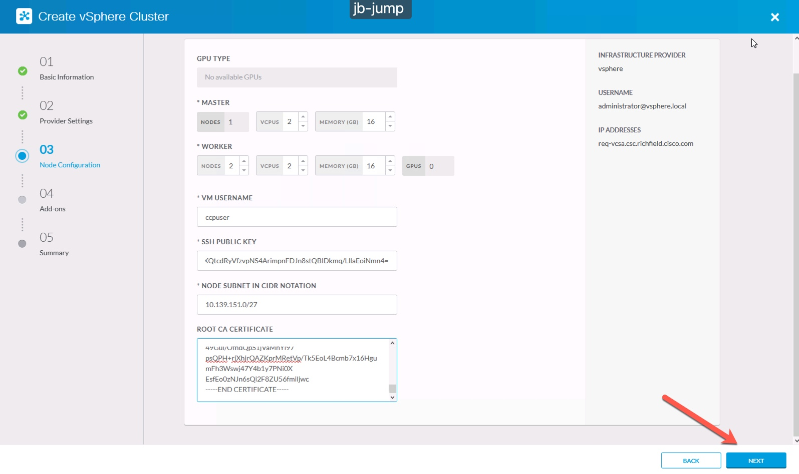
* Select "Next"

#### Page 4

* Leve the defaults for Page 4.  These are addons that can be deployed as part of CCP but are not required.
	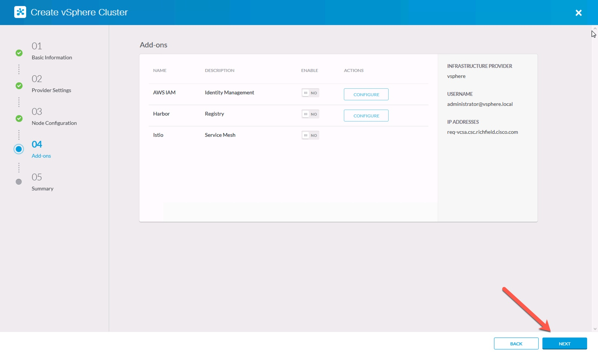
	* Select "Next"

#### Page 5
* If the summary looks good select "Finish"
	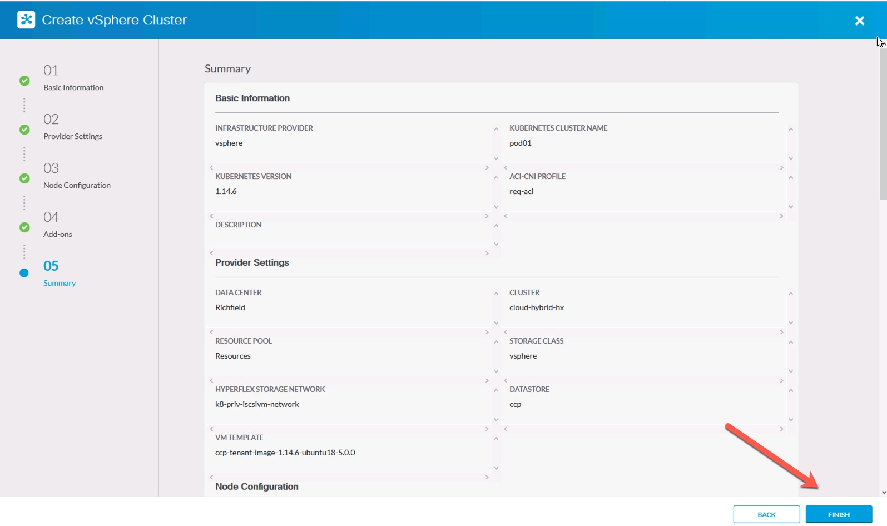
	
The cluster creation process takes a few minutes.  
While that is happening, go to your remote desktop session where Postman is and in the upper left hand corner select "Runner"
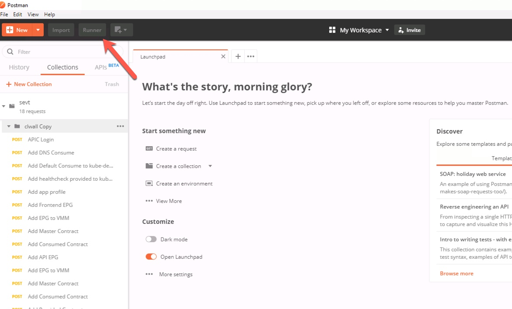
	* Runner is a tool within postman that calls a list of APIS Commands
		* The APIs that we are calling are going to deploy an application profile within ACI so that we do not have to "click, click, click"
	* In the "Choose a collection or folder" box select "SEVT" and "clwall copy"
	* Select the environment that you created earlier under "Environment"
	* Scroll to the bottomw and select "Run sevt"
	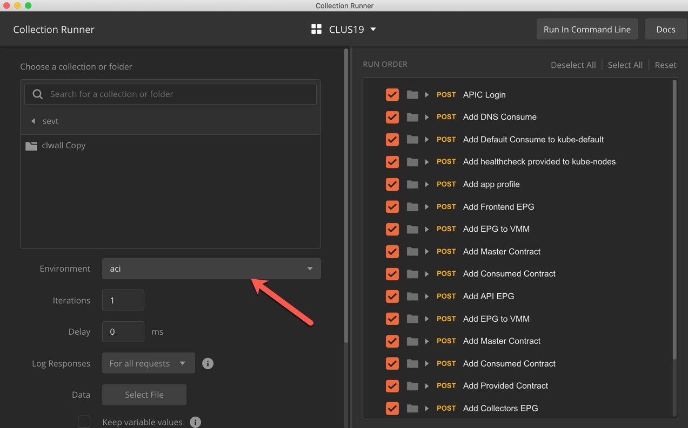

## Explore ACI

* Log into your APIC Dashboard
* Select "Tenants"
* Select YOUR Pod Number
* Expand "podXX"
	* Application Profiles
	* Select "livewall"
		* On the right hand side select "Topology"
	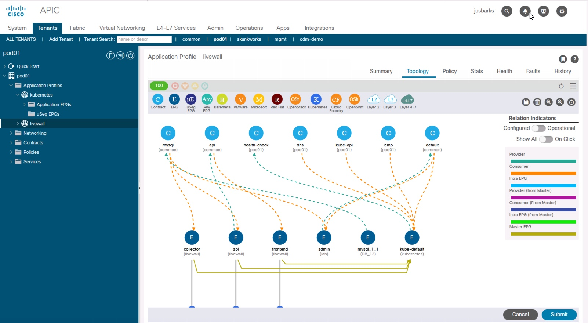
	You can explore the policy as you would like.

## Connect to CCP Cluster
* Go to your SSH Host
	* Set the MGMT_HOST variable
		```
		export MGMT_HOST=10.139.13.50
		```
	* login to CCP and get the cookie
		```
		curl -k -c cookie.txt -H "Content-Type:application/x-www-form-urlencoded" -d 'username=admin&password=admin' https://$MGMT_HOST/2/system/login/
		```
	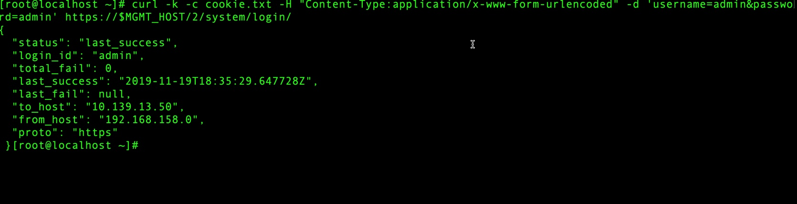
	
	* Get your cluster UUID
	```
	curl -sk -b cookie.txt https://$MGMT_HOST/2/clusters | jq -r '.[].name,.[].uuid'
	```
	* The Pod name is listed ontop
	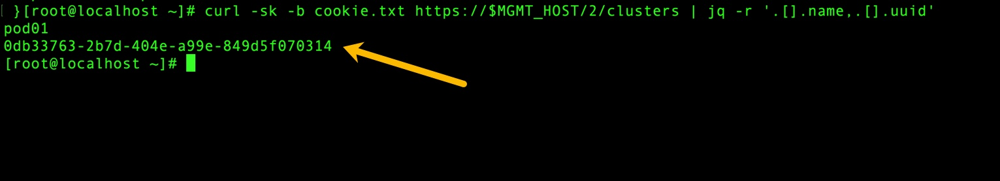
	
	* Set the tenant cluster uuid as a variable
	```
	export TC=<uuid from previous command>
	```
	
	* Get the kubeconfig file
		* kubeconfig is a yaml file that has the configuration and secret information to connect to our kubernetes cluster
		```
		curl -sk -b cookie.txt https://$MGMT_HOST/2/clusters/${TC}/env -o kubeconfig.env
		```
	* Set the kubeconfig files as an environment variable
		```
		export KUBECONFIG=~/kubeconfig.env
		```
	* Test your connection
		```
		kubectl get nodes
		```
		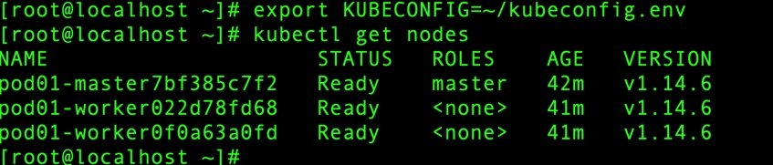
		
## Deploy Database
* We are deploying a database onto an existing MYSQL Server.  Substitute your pod number for "podXX"
	
	```
	mysql -h 10.139.11.209 -u root -p -e "create database podXX";
	```
	The password when prompted is "C1sco123"
	```
	mysql -h 10.139.11.209 -u root -p podXX < mysql.sql
	```
	The password when prompted is "C1sco123"
	
* To verify if the database is there run the following command.  You should see a table like below.

	```
	mysql -h 10.139.11.209 -u root -p -D pod01 -e "show tables";
	```
	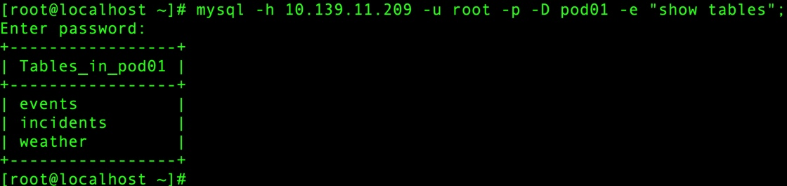
	
## Clone the Git Repo
* We need to download the files for the rest of the lab.  From the SSH host run the following:
	
	
	```
	git clone https://github.com/3pings/sevt-fall-fy20.git
	cd sevt-fall-fy20/
	```

## Deploy LiveWall
* The rest of this lab will utilize these files.  The first thing we are going to need to do is to deploy our "livewall app".

	```
	cd 01\ -\ wall/
	```
* In the folder there is a script that runs and will build our yaml files with our relevant pod information.  The foormat of this command is below replacing "podXX" with your pod information
	
	```
	./01-launch-livewall.sh podXX
	```
	
	You should see something like the below
	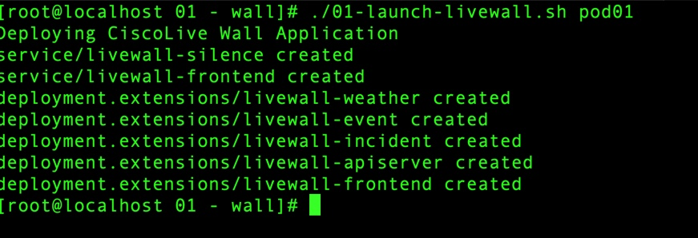
	
* Using Kubectl we can get the status of the pods
	
	```
	kubectl get pods
	```
	
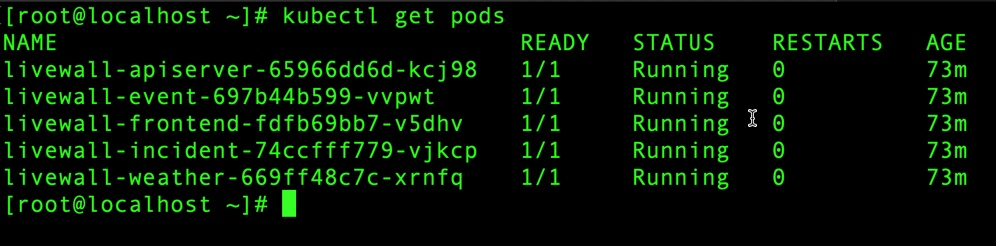

* We can also get the IP address of our frontend

	```
	kubectl get svc
	```

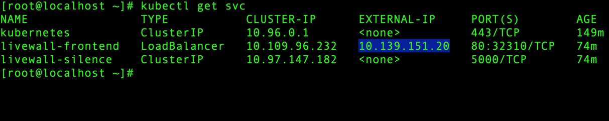

* Open a web browser and browse too the address shown.  In the example it is http://10.139.151.20

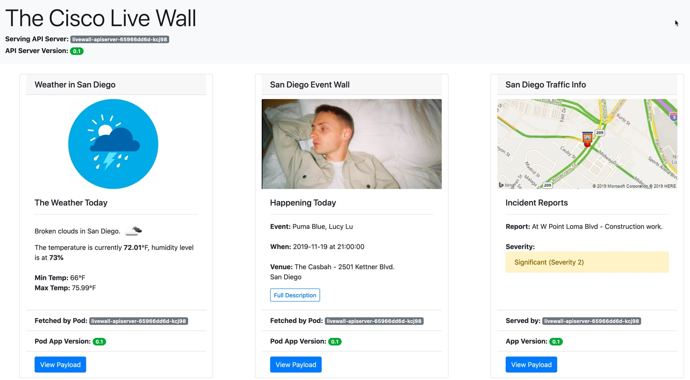

* So what is happening?  To get a better view let's browse back to APIC.

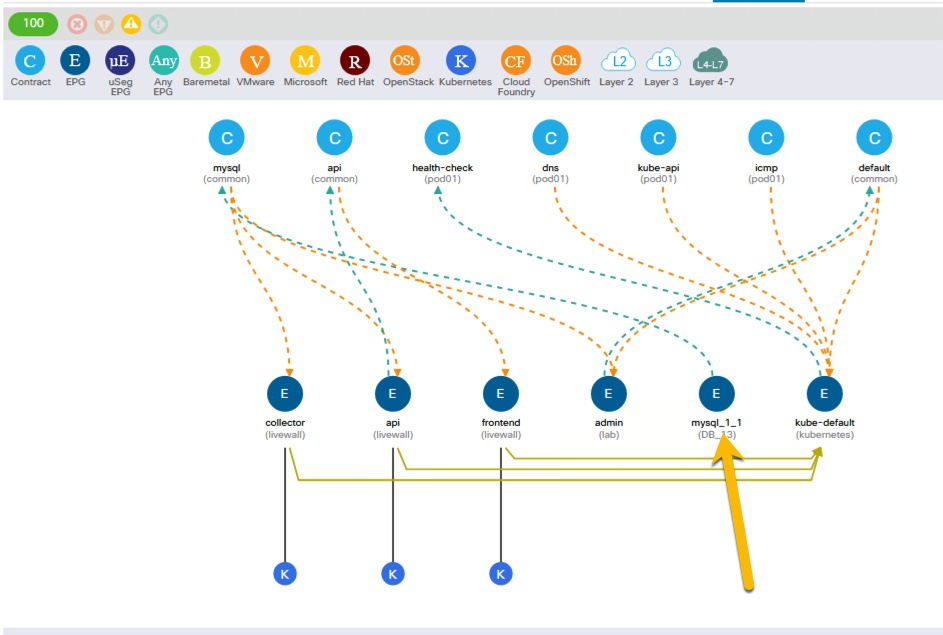

* Notice that there is an EPG which is not part of our application profile.  This is an EPG with a virtual machine running our mysql database we created earlier.

* Let's look at a different view.  Navigating to the "skunkworks" tenant and drilling into the CLUS19-DB_13 Application Profile under the topology we see the following:

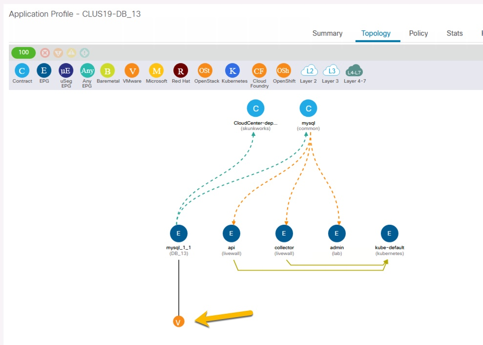

* The purpose of this is to show policy across vms and kubernetes pods (of course this would apply to baremetal also)

* Let's navigate back to our tenant (podXX) and look at the API epg beneath the "livewall"

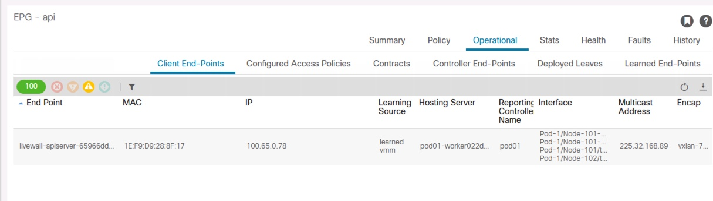

* Expand the "api" epg on the left and select "contracts"

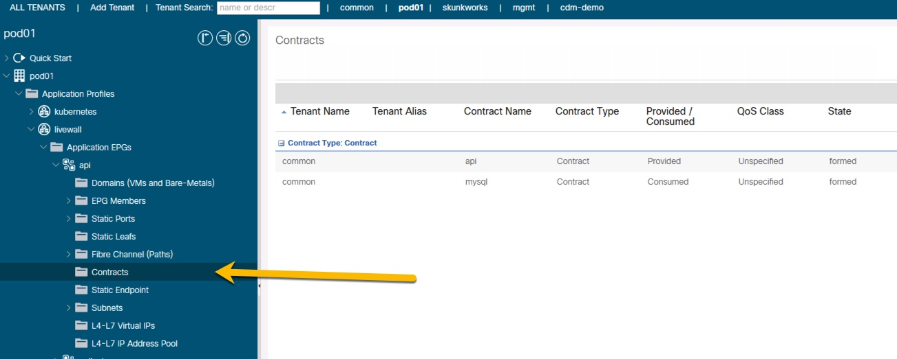

* Notice that there are two contracts, a provided "api" contract which is being consumed by the frontend and our collectors, and a consumed mysql contract which is provided my the "mysql" epg we looked at earlier.

* Let's delete the "mysql" contract
	* Right click on the contract and select "delete"
	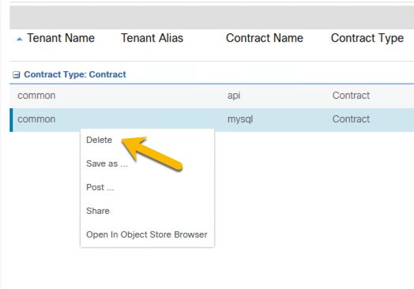
* Now browse back to our web frontend we looked at earlier.
* What happened?
* Why?

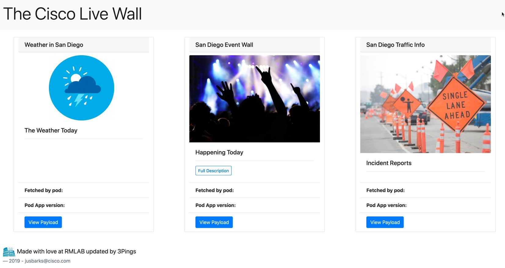

* Where is the data?

* Let's add the contract back
	* Right click on "contract" under the "api" epg
	
	 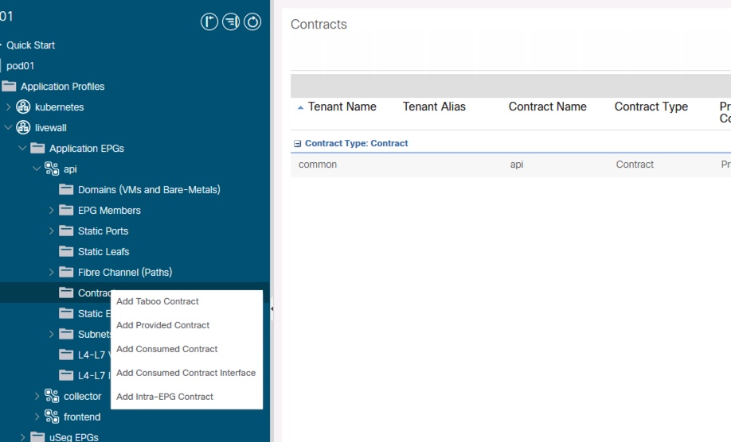 
	
	* Select "Add Consumed Contract"

	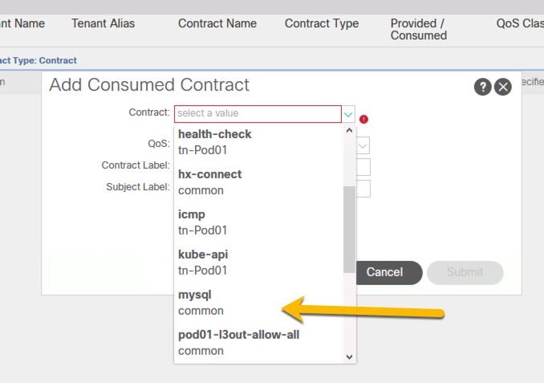
	
	* Select "mysql" from the dropdown
	* Select "Submit"

* Check your site and see what happened.

## Persistant Volumes

* Change directories to the Message Board

	```
	cd ../02\ -\ messageboard/
	```
	
* Explore the files in this folder

	```cat 01-message-board-pvc.yam
	```


* Notice the "StorageClassName"
	* Let's exporer further

		```
		kubectl get sc
		```
	
	* What do you see?
	
	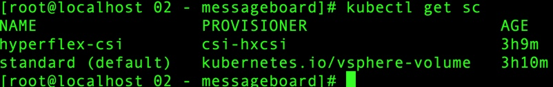
	
* Understanding the CSI

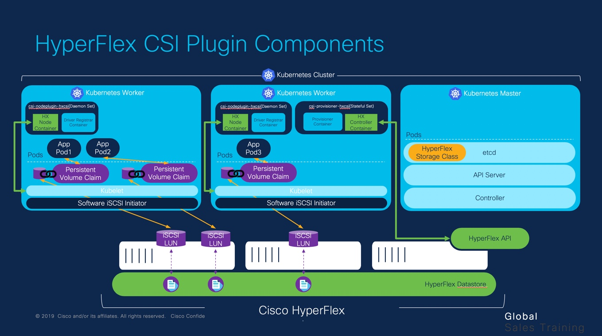

## Deploy Message Board

* Apply the Persistant Volume Claim

```
kubectl apply -f 01-message-board-pvc.yaml
kubectl get pvc
```

* Apply the Message Board yaml file

```
kubectl apply -f 02-message-board.yaml
```


* Get the Servicve IP

```
kubectl get svc
```


* Notice the Port Number

* Web to the IP and the port number provided


* Select "Signup"
* Provide the requested info (this is dummiy info for demo purposes only)


* Sign in using the credentials you provided


* Create a few messages to fill in the database.


* Apply the new version of the messageboard

```
./03-changeimage.sh 
```

* What happened?


* Notice the messages stayed.
* Why?
* 
